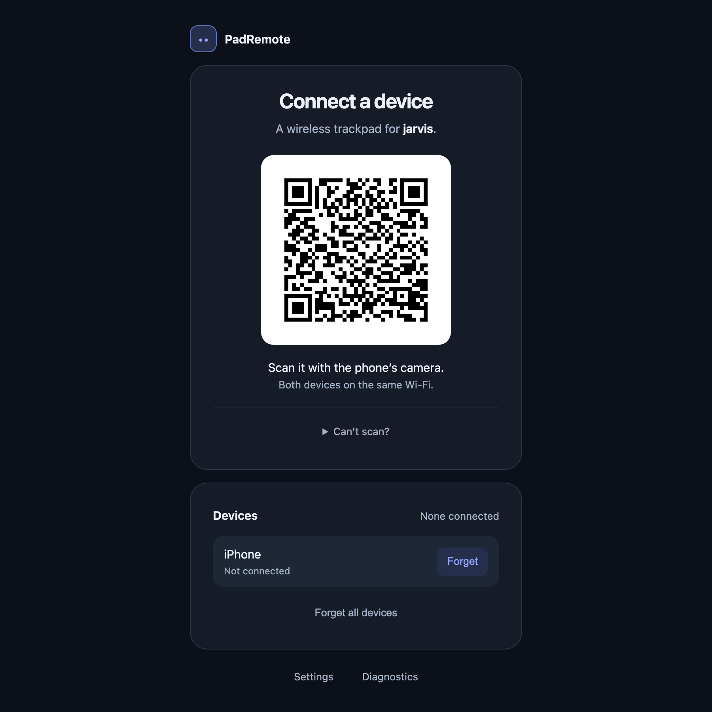
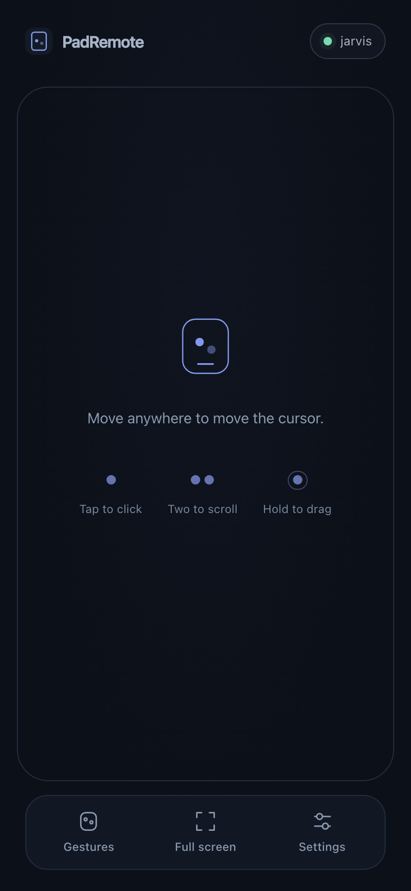
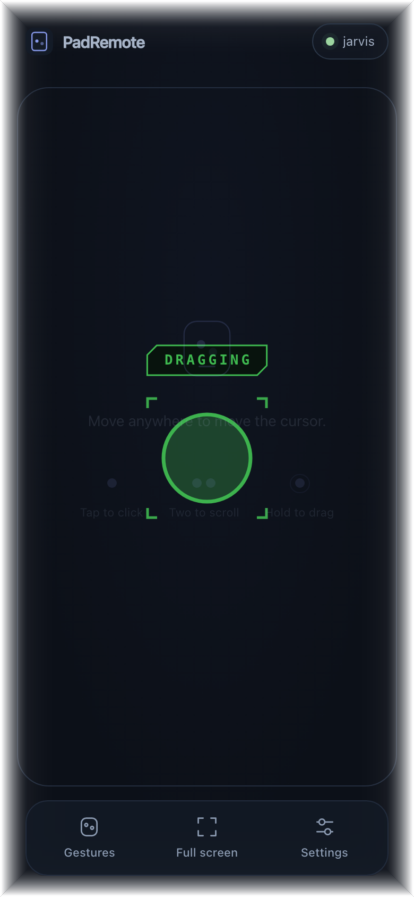
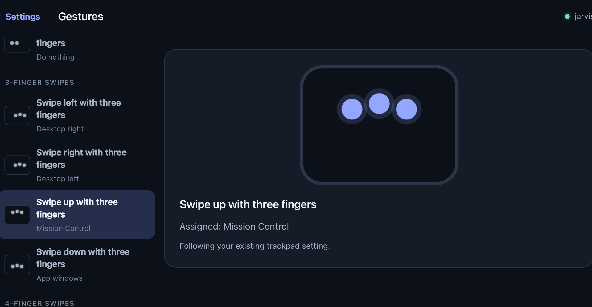
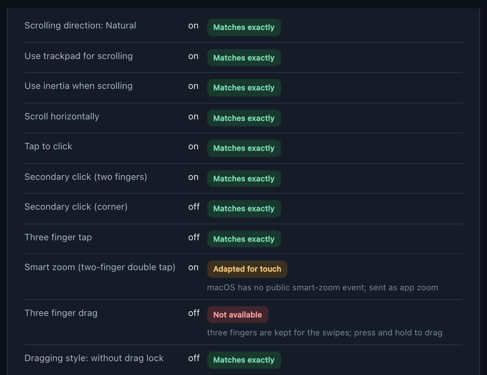

<h1 align="center">PadRemote</h1>

<p align="center">
  <b>Your phone is the trackpad.</b><br>
  A wireless trackpad for your Mac, running on the phone already in your pocket.
  The computer runs a small menu-bar app;<br>the phone just opens a web page — no
  app store, no account, and nothing leaves your Wi-Fi.
</p>

<p align="center">
  <a href="https://padremote.github.io">padremote.github.io</a> ·
  <a href="docs/README.md">docs</a> ·
  <a href="docs/user/getting-started.md">getting started</a> ·
  <a href="docs/user/troubleshooting.md">troubleshooting</a>
</p>

## Install

```sh
./install.sh
```

Builds the app with the phone page inside it, installs it to `~/Applications`,
launches it. Grant **Accessibility** when macOS asks. Needs Rust and Node.

| 1. Open the QR | 2. Scan it | 3. That's it |
|:--:|:--:|:--:|
|  |  |  |
| Menu bar → **Connect a device…** | Point your phone's camera at it | The whole screen is the trackpad |

Both devices on the same Wi-Fi. [Full walkthrough →](docs/user/getting-started.md)

## What it does

| | |
|---|---|
| Move one finger | Cursor, with a macOS-like acceleration curve |
| Tap · two-finger tap · three-finger tap | Left · right · middle click |
| Two fingers, move | Pixel-precise scroll, with momentum |
| Press and hold, then move | Click-and-hold dragging, and selecting text |
| Three and four fingers, swipe | Spaces, Mission Control, app windows |
| Four-finger pinch · five-finger spread | Launchpad · Show Desktop |

Every direction is its own setting, and every action a gesture can take is
listed rather than hidden in a menu.

<p align="center"></p>

## It copies the trackpad you already use

It **reads your Mac's own trackpad settings** on startup and every half-second
after, and says what it managed to do with each one. Change a switch in System
Settings and it follows within seconds.

<p align="center"></p>

[Gestures, and what can't be copied →](docs/user/gestures.md) ·
[Settings →](docs/user/settings.md)

## Also

- **Several devices at once** — a phone and a tablet take turns with the cursor:
  it goes to whoever touches next, as soon as the other stops.
- **Pairing is enforced** — the QR carries a 128-bit secret, every connection
  answers an HMAC-SHA256 challenge, web pages are refused at the handshake, and
  **Forget** revokes one device without disturbing the others.
- **Not yet** — TLS, PWA install, a signed installer. The link is plain `ws://`.
  [Threat model →](docs/dev/threat-model.md)

## Build from source

The page is compiled into the app, so build it first.

```sh
cd web && npm install && npm run build
cargo run --manifest-path desktop/Cargo.toml
```

It prints the address to open on your phone.

[development](docs/dev/development.md) · [architecture](docs/dev/architecture.md) ·
[design](docs/dev/design.md) · [protocol](docs/dev/protocol.md) ·
[gotchas](docs/dev/gotchas.md) — every trap that has already cost a day

The gesture engine is pure and OS-agnostic; the Windows and Linux backends are
written but **have never been run on real hardware**
([porting](docs/dev/porting.md)). Everything is indexed in
[`docs/`](docs/README.md); the specification is [`plan.md`](plan.md). Licensed
[MIT](LICENSE).
