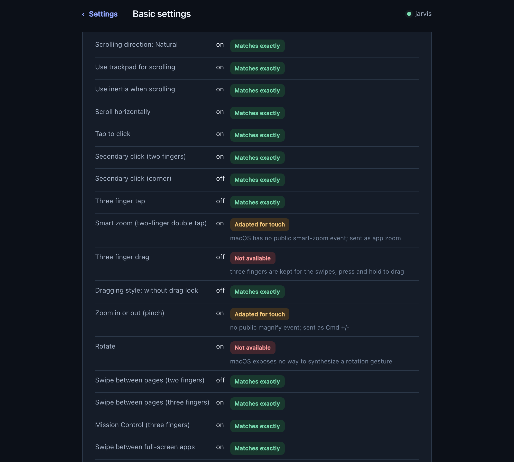
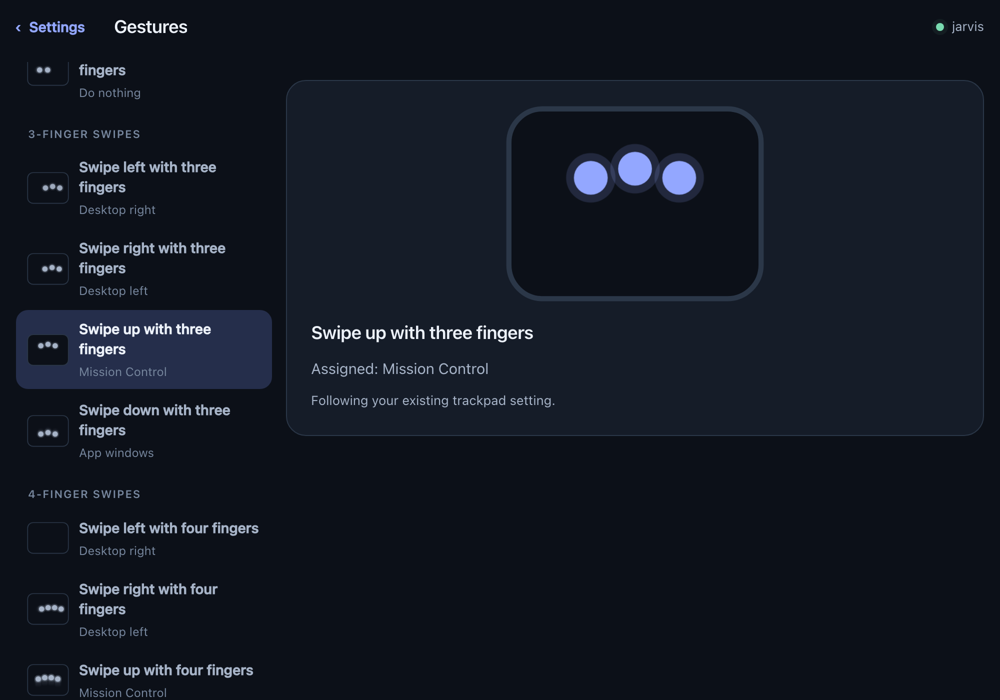

# Gestures

## It copies your Mac's trackpad

PadRemote reads your real trackpad settings and matches them, so it behaves like
the trackpad you already use rather than like some fixed default. Three-finger
tap off on your Mac means no middle click here. Natural scrolling there means
natural scrolling here.

It re-reads them about twice a second, so a switch changed in **System Settings
→ Trackpad** takes effect within a second or two. No restart.

To see exactly what it copied, open **Settings → Basic settings → What it
copies**. Every one of your Mac's trackpad settings is listed, with what
PadRemote managed to do with it:

Each gesture it decides says so too, and names the setting responsible:

## The gestures

| Gesture | Does | Follows your setting for |
|---|---|---|
| One finger, move | Move the cursor | tracking speed is approximated — see below |
| Tap | Left click | Tap to click |
| Two-finger tap | Right click | Secondary click |
| Three-finger tap | Middle click | Three finger tap |
| Four-finger tap | *unbound* — yours to assign | nothing; your Mac has no four-finger tap |
| Two fingers, move | Scroll | Scroll direction, inertia, horizontal scroll |
| Two fingers, sideways | Back / forward | Swipe between pages |
| Three fingers, left/right | Switch full-screen apps | Swipe between pages |
| Three fingers, up/down | Mission Control | Mission Control |
| Four fingers, left/right | Switch full-screen apps | Swipe between full-screen apps |
| Four fingers, up / down | Mission Control / App windows | Mission Control |
| Four fingers, pinch in | Launchpad | Launchpad |
| Five fingers, spread | Show Desktop | Show Desktop |
| **Press and hold, then move** | **Drag, and select text** | always available — see below |

**Every direction is its own setting** — three fingers up and three fingers down
are two rows, not one — and each starts out following the trackpad setting it is
copied from, so the table is what you get until you change something. See
[Settings → Gestures](settings.md#gestures).

**The four-finger tap is the one gesture your Mac does not have**, so it arrives
unbound. Give it a job in **Settings → Gestures** — Mission Control, a
screenshot, Spotlight, lock the screen, or any of twenty-odd others. Nothing
about your Mac changes when you do.

**Pinch zoom and two-finger double tap are off by default.** A pinch is the same
two fingers moving as a two-finger swipe, and on a surface the size of a palm
they are millimetres apart; getting it wrong means an ordinary scroll zooms.
Both are still under **Advanced** for anyone who wants them.

**You can change your mind part-way through.** Move the cursor with one finger,
lay a second down, and it becomes a scroll — no need to lift and start again,
exactly as on the trackpad. The trade is the same one a trackpad makes: a stray
second touch during a move interrupts it too. A drag is the exception; once the
button is held, a second finger landing does not take it apart.

---

## Selecting text: press and hold

On a trackpad you hold the button, or Force Click, and drag. Your phone has no
button and no pressure sensor, so a **long press** stands in for both.

Rest one finger without moving. A ring charges around it; when it fills, the
button is held and you are dragging. Slide to select, lift to release.

**Start from a standstill.** The hold only counts from a finger that has not yet
moved — once you have started steering the cursor, that touch can no longer
become a drag however long you pause. Lift, put the finger back down, and hold.
This is what stops an ordinary move that pauses for a moment from grabbing
whatever is under the cursor.

 

**What you'll see**, designed to be readable without looking at the phone —
your fingertip covers about a centimetre of display, so the signal is drawn
where your hand isn't:

| | |
|---|---|
| **Charging** | Four blue brackets close in on the **corners of the screen**, and a ring tightens at your fingertip |
| **Armed** | A line sweeps down, the brackets are thrown outward, the ring turns green where it stood, the edges bloom white, and **DRAGGING** appears clear of your hand |
| **Dragging** | White light glows in from all four edges and pulses about once every two seconds, and a green bracket box holds your fingertip |
| **Released** | A ring rings out from where you let go, so you can see the drop landed |

- **Half a second**, deliberately: a shorter hold caught ordinary cursor moves
  that paused for a moment and turned them into selections.
- **Moving spends the hold.** The ring stops charging the instant the finger
  leaves where it landed. No ring while resting means your finger already
  travelled — lift and press again.
- **The edges are the cue to trust.** Blue brackets still closing in mean keep
  waiting; the whole rim glowing white means go. That reads out of the corner of
  your eye, which is how you'll see it while watching the other screen.
- **A buzz is a bonus, never the signal.** iPhone cannot vibrate at all (iOS
  Safari has no vibration API) and many tablets have no motor. The animation
  always arrives, and so does a **click sound** — one when the button goes down,
  a quieter one when it comes back up, like a real trackpad. Turn it off under
  **Settings → Click sound**.
- **This is the one gesture not copied from your Mac.** It substitutes for
  hardware you don't have, so no trackpad setting can take it away — otherwise a
  Mac set to three-finger drag would leave you no way to select text at all.

macOS treats dragging as **one choice** with several options: *Three-Finger
Drag*, *without drag lock*, *with drag lock*, or off. PadRemote has no
three-finger drag — three fingers are kept for the swipes — so what it takes
from that choice is whether **one** finger may start a drag. Either drag-lock
option and a tap-then-move drags; Three-Finger Drag or off and one finger only
moves the cursor.

---

## What can't be copied

The mirror report above says so rather than pretending — **Adapted for touch**
where PadRemote gets close, **Not available** where nothing can:

| | |
|---|---|
| **Force Click** | Your phone screen has no pressure sensor |
| **Three-finger drag** | Three fingers are kept for the swipes. Press and hold does the same job |
| **Rotate** | macOS exposes no way for any app to synthesize a rotation. PadRemote could detect the twist; nothing could deliver it |
| **Tracking and scroll speed** | Readable, but Apple's acceleration curve is private, so these are approximations — tune `sensitivity` by hand |
| **Zoom** | Sent as `⌘+` / `⌘−`, because no public API can synthesize a magnify gesture. It steps rather than glides, and only works in apps with a zoom command |

Swipes are likewise sent as the Mission Control keyboard shortcuts (Ctrl +
arrow). If you have disabled those in System Settings → Keyboard, PadRemote
detects it and warns at startup rather than silently doing nothing.

---

## Tuning

Most of it is on the [settings page](settings.md) — pointer speed and scrolling
live in **Basic settings**, everything else under **Advanced**. The ones worth
touching first:

| Setting | Where | What it changes |
|---|---|---|
| **Pointer speed** | Basics | Overall cursor speed |
| **Acceleration** | Advanced → Pointer acceleration | How much faster the cursor goes on a quick flick. Lower it if it feels twitchy; `0` is off |
| **Scroll acceleration** | Advanced → Scrolling | How far a quick flick carries. `0` is strictly one-to-one |
| **Hold before a drag starts** | Advanced → Taps and presses | The phone's ring follows this automatically, and so does **How far a tap may stray** |

Underneath, all of it is
`~/Library/Application Support/PadRemote/config.json`, which hot-reloads: edit
it by hand and feel the change within about half a second. Setting
`"followSystem": false` stops PadRemote copying your Mac and pins it to the file
alone.
