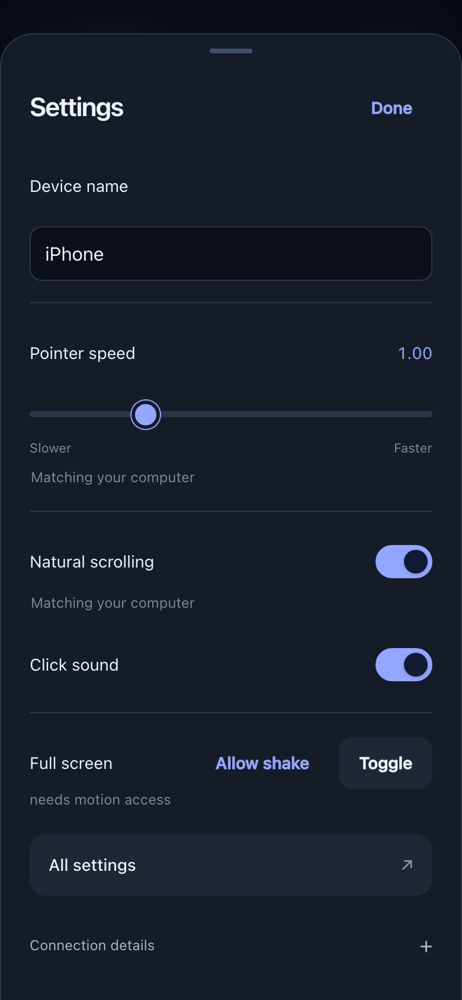
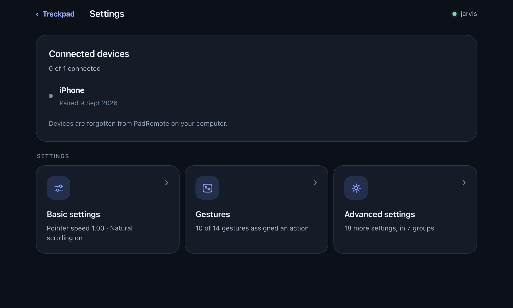
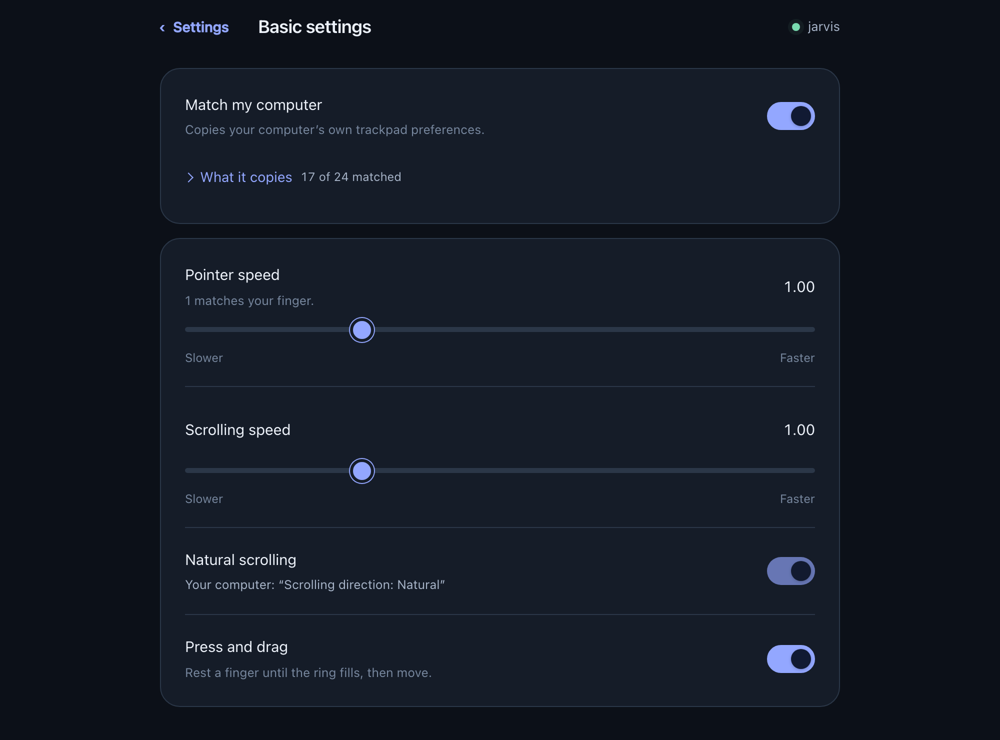
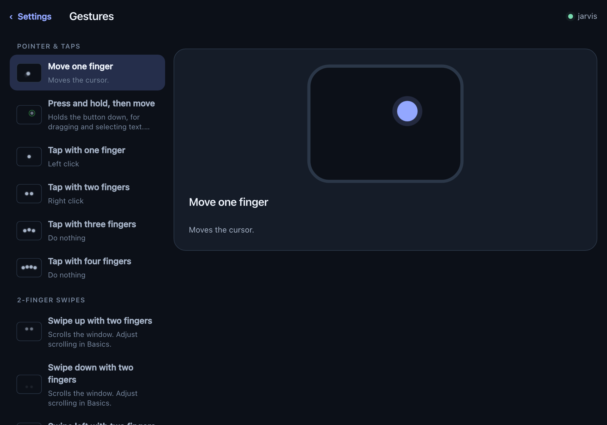
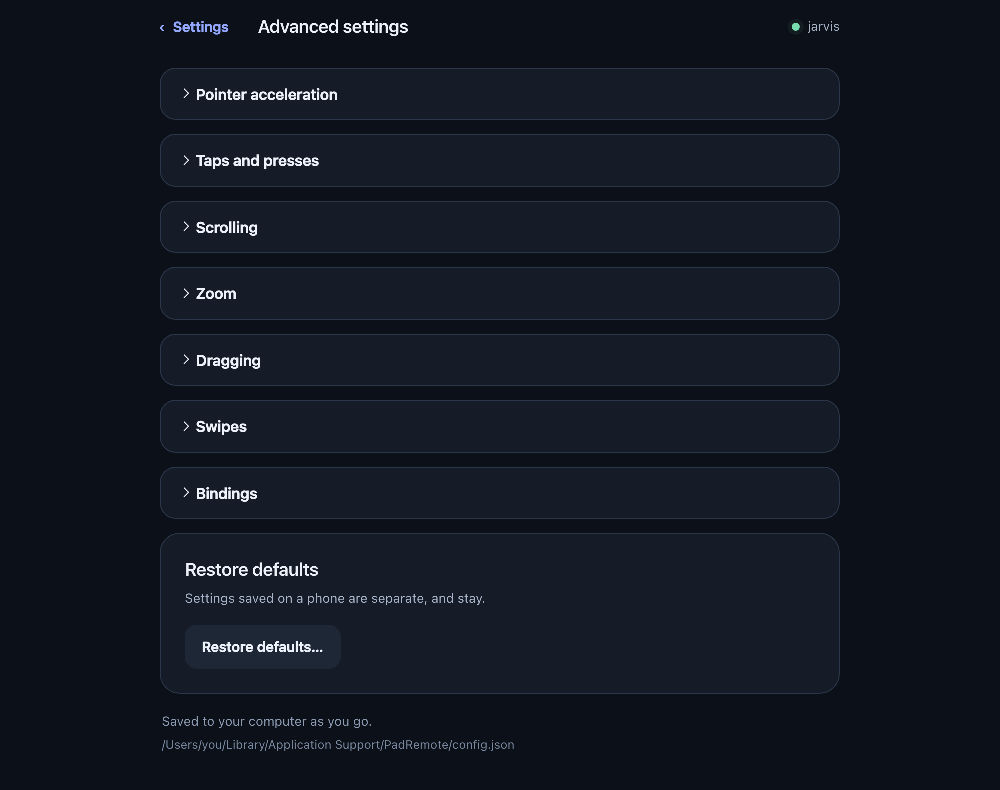

# Settings

Two places, for two jobs.

| | |
|---|---|
| **Quick settings** — tap **Settings** at the bottom of the trackpad | Overrides for the device in your hand |
| **The full page** — menu bar → **Settings…**, or **All settings** on the phone | Everything, saved on the computer |

It is the same page from the phone or the computer, live on both at once, and it
saves as you change something. Anything your computer's own trackpad decides is
shown locked, with the setting that decides it named beside it.

---

## Quick settings, on the phone

| Control | What it changes |
|---|---|
| **Device name** | The name shown when several devices share a computer |
| **Pointer speed** | A speed override for this device |
| **Natural scrolling** | A scrolling-direction override for this device |
| **Click sound** | Sound when a drag presses and releases |
| **Full screen** | A quieter trackpad, with the app's controls hidden |

Pointer speed and natural scrolling read **Matching your computer** until you
change one. Once changed, that control offers **Use my computer's setting** to
hand it back. A phone and a tablet can keep different overrides, and an override
survives the computer re-reading its own settings.

 

---

## The full page

It opens on your connected devices, with the rest behind three cards. Each card
says what is currently set behind it — the pointer speed, how many gestures are
assigned — so most questions are answered without opening anything.

**‹ Settings** returns to that list from any page; **‹ Trackpad** returns to the
trackpad. Your browser's Back button does the same.

### Basic settings

**Match my computer** uses your computer's trackpad preferences for the settings
it controls, and **What it copies** opens the report of exactly which ones it
matched, adapted or could not reproduce. While it is on, the controls it covers
are greyed out with a note naming the setting responsible — your computer keeps
writing those, and PadRemote could not hold a different value even if you set
one. The switch that releases them is the same one.

### Gestures

Three columns: the gestures on the left, the one you picked demonstrated in the
middle, everything it can be set to on the right. On a narrow screen they stack.

Every row demonstrates itself — a small trackpad beside the name shows the
fingers doing it, so one finger or three, sideways or up and down, can be told
apart without reading a word. Dots move the way your fingers would, on a slight
curve because that is how fingertips land, and blur behind themselves as they
cross the pad. The loops run on their own; with reduced motion enabled they hold
a single frame, where the blur is what says which way the gesture goes.

Rows are grouped by the hand that makes them: **Pointer & taps**, then **2-**,
**3-** and **4-finger swipes**.

**Each direction is its own setting.** Three fingers up and three fingers down
are two rows, two demonstrations and two actions — so Mission Control upward and
the volume downward is a thing you can have. A direction nobody has touched
reads **Use existing setting** and says what that currently does. Choose
anything else and only that direction stops following.

Every action is listed at once rather than hidden in a menu, with a search box
for the long lists: a few **Recommended** first, then the rest alphabetically
under **Other actions**. Only actions a gesture can actually perform are offered
— a sideways swipe is never offered Mission Control, which travels up and down —
and they are named the way your computer names them.

### Advanced settings

Seven groups of specialist options — acceleration, tap timings, scrolling, zoom,
dragging, swipe travel, and the bindings that are off by default (two-finger
double tap, corner secondary click, four-finger pinch, five-finger spread).

**Restore defaults** resets the computer's configuration after confirmation.
Per-device overrides from quick settings are separate, and stay.

---

## Full screen

Tap **Full screen** in the trackpad toolbar, or **Toggle** in quick settings;
**Exit full screen** brings the controls back. Shaking the phone can toggle it
too, where the browser allows motion access — a plain HTTP connection does not,
and quick settings says so and offers **Allow shake** when permission can be
asked for.

The browser decides whether the page can use native full screen. When it cannot,
PadRemote hides its own controls instead. On an iPhone, adding the page to the
Home Screen gives you a way to open it without the usual browser bars.

## Un-pairing

Done on the computer: the connect page gives each device a **Forget** button,
with **Forget all devices** under the list. See
[getting started](getting-started.md#your-devices). Opened from a phone the
device list is there to read — a phone cannot revoke another phone's pairing, or
its own.

## The configuration file

Underneath, all of it is
`~/Library/Application Support/PadRemote/config.json` — the settings page prints
the path at the bottom. It **hot-reloads**, so editing it by hand works exactly
as the page does. The first save from the page expands the file to include every
current setting; effective values stay the same, and unrecognised keys are
removed.

The settings page needs a connected computer: it renders from the config the
computer sends, so there is no demo mode.
