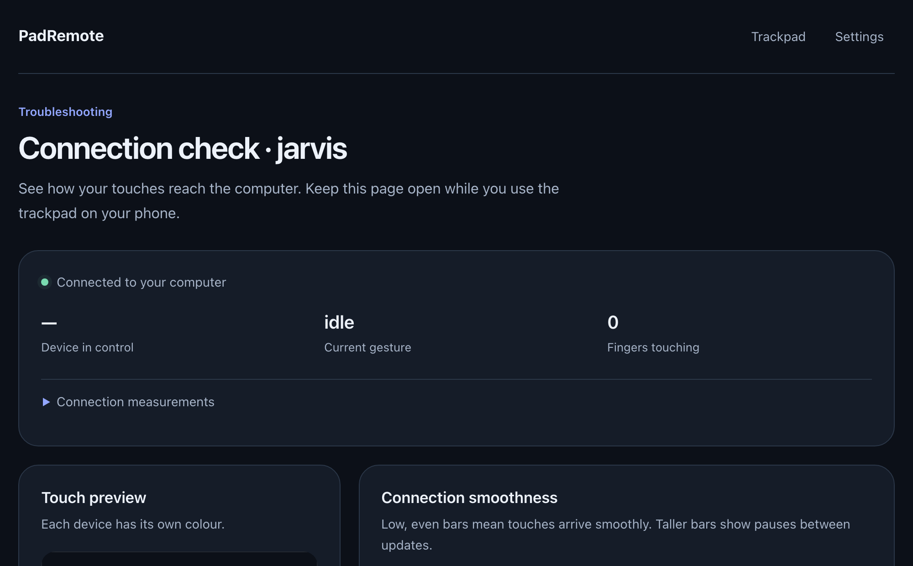

# Troubleshooting

Every problem here is one that actually happened, listed by the symptom that
gave it away.

| Symptom | Most likely |
|---|---|
| [Cursor doesn't move at all](#the-cursor-doesnt-move-at-all) | Accessibility permission, or `--dry-run` |
| [Phone says "This site can't be reached"](#this-site-cant-be-reached) | PadRemote isn't running, or your Mac's address moved |
| [Phone says it isn't paired](#the-pad-says-it-isnt-paired) | Never scanned, or the pairing was revoked |
| [Status flickers between the name and "offline"](#the-status-flickers) | Network, not a second device |
| [Cursor drags instead of moving](#the-cursor-drags-instead-of-moving) | *Tap and drag*, copied from your Mac |
| [Scrolling goes the wrong way](#scrolling-goes-the-wrong-way) | This phone has overridden the setting |
| ["Someone else is using this computer"](#someone-else-is-using-this-computer) | Another device has the cursor — just touch the pad |
| [Cursor freezes until I lift my fingers](#the-cursor-freezes-until-i-lift-my-fingers) | A second finger landed and left mid-gesture |
| [Four-finger gestures don't fire](#four-finger-gestures-dont-fire) | Fingers landing too far apart in time |
| [One swipe axis works, the other doesn't](#one-swipe-axis-works-and-the-other-doesnt) | Your Mac has that one turned off |
| [The phone doesn't buzz](#the-phone-doesnt-buzz-when-a-drag-starts) | Expected on iPhone; use the click sound |
| [Zoom is steppy](#zoom-is-steppy) | Expected — no public magnify API |
| ["Port 8787 is already taken"](#port-8787-is-already-taken) | A second copy is running |

---

## Before guessing, look

Menu bar → **Connect a device…** → **Diagnostics** (or the `debug ->` URL
printed at startup). It attaches as a **read-only observer**, so it never takes
control away from your phone — unlike opening the normal phone page on your Mac,
which does.



It separates the three things that all *feel* the same:

| What you see | What it means |
|---|---|
| **Touch preview** looks ragged | The phone isn't capturing cleanly |
| **Connection smoothness** is orange or red | The network is delivering unevenly |
| **Recent actions** disagree with your hand | The recognizer is misreading you |

Under **Connection measurements**:

- **Average gap · ms** — time between batches; a steady 8–16 ms is smooth.
  Measured only *during* a touch, so pauses between gestures don't pollute it.
- **Gap variation · ms** — fastest to slowest. High means stutter even when the
  average looks fine.
- **Peak fingers** — how many fingers the gesture is being judged on.

---

## The cursor doesn't move at all

**The phone will tell you.** If the computer cannot move its own cursor, the pad
shows an amber dot and says so rather than showing a healthy connection. Read
that line first — it names the fix. Everything else looks perfectly normal in
this state, which is why the page has to say it out loud.

**Accessibility permission is missing** — the commonest cause by far. macOS
accepts injected events from an untrusted process and silently discards them.
System Settings → Privacy & Security → Accessibility → enable PadRemote. The
cursor starts moving the moment you tick the box; nothing to restart. The grant
is **per app** (one for your terminal does nothing for `PadRemote.app`) and
**per build** (a rebuilt binary needs it again).

**It was started with `--dry-run`** — then it is reading every gesture and
moving nothing, on purpose. Quit and start it without the flag. Check you have
only one copy running: a phone pointed at a dry-run copy on another port looks
exactly like a healthy connection that does nothing. **Connect a device…**
always opens the copy you are looking at.

## "This site can't be reached"

The browser never loads PadRemote's page at all.

**If the address in the QR matches the menu bar's — PadRemote isn't running.**
It serves the page itself, on the same port your phone connects to, so if the
app is gone there is nothing to load. Look for the ●● icon in the menu bar; if
it isn't there, launch PadRemote (Cmd-Space). `./install.sh --login` makes it
start with you.

Check from the Mac with `curl -I http://localhost:8787/`. A `200` means the page
is served and the problem is between phone and Mac — different Wi-Fi, or a
network with client isolation. If it loads but says PadRemote was **built
without its phone page**, rebuild with `./install.sh`.

**If the QR worked yesterday — your Mac's Wi-Fi address changed.** The QR
encodes the address, so an old one points at nothing. PadRemote notices within
about five seconds and a connect page left open redraws itself, so open
**Connect a device…** and re-scan whatever code is on screen. Your phone stays
**paired** across the move — this is a re-scan, not a re-pair. To stop it
recurring, give your Mac a reserved IP in your router.

## The pad says it isn't paired

Two different messages, two different causes.

**"Not paired" on a phone that never worked** — the page was opened without ever
being pointed at a computer: a bookmark, a typed address, or the home-screen
icon before the first scan. Scan the QR. After that the phone remembers and
reconnects on its own.

**"Not paired yet" on a phone that *was* working** — it reached your computer
and was turned away, because its pairing code is no longer the right one:

- somebody used **Forget all devices**, or **Forget** on this phone's row
- the address was typed or bookmarked, so it never carried a code
- the phone's saved data was cleared — a wiped browser, or private browsing

Scanning a fresh code is what fixes it. The pad will not keep retrying, because
it would be refused identically every time.

## The status flickers

Between your computer's name and "offline": the page is failing to reach the app
and retrying. This is a network problem, not a second device — a device waiting
its turn stays connected and says so.

- Check PadRemote is still in the menu bar.
- Check phone and Mac are on the same Wi-Fi, and that it isn't a guest network
  with client isolation.
- Don't leave the normal phone page open on your Mac. Use **Diagnostics**, which
  observes without taking control.

## The cursor drags instead of moving

Tapping and then immediately moving is starting a drag, so the cursor selects
text instead of pointing. That is *tap and drag*, and it ships off.

Your Mac's dragging style is copied. If yours is *without drag lock*, tapping
and immediately moving starts a drag on your trackpad too, and the phone is
doing what the Mac does. Change it in **System Settings → Accessibility →
Pointer Control → Trackpad Options**, or turn *Tap and drag* off under
**Advanced settings** — though with matching on, the next reading of your Mac's
preferences turns it back on.

## Scrolling goes the wrong way

PadRemote copies your Mac's **Scrolling direction: Natural**, so it should
already match. If it doesn't, this phone has taken the setting over. Open
**Settings** on the pad, under *Natural scrolling*:

- **"Matching your computer"** — the phone is following your Mac, so the Mac's
  own setting is what to change: System Settings → Trackpad → Scroll & Zoom.
  PadRemote follows within a second.
- **"Use my computer's setting"** — this phone is overriding. Tap it to hand the
  setting back. The override is local to this phone, so your tablet is
  unaffected either way.

Pointer speed works the same way, except it comes from the config rather than
from your trackpad: macOS keeps its tracking-speed curve private, so there is
nothing to copy.

## "Someone else is using this computer"

More than one phone or tablet is connected, which is fine — they take turns, and
the status dot turns amber on the ones waiting.

**To take over, just touch the pad.** The cursor comes to you as soon as the
other device stops, about a third of a second after it lifts. No button, nothing
to close. While you wait your touches are still read (the trails still draw);
they simply move nothing.

If nothing you do ever takes effect, read the name in the message — it may be a
forgotten tab on another device, and closing it hands the cursor over for good.
Names come from each device's own **Settings → Device name**, so rename one if
two of them read "iPhone".

## The cursor freezes until I lift my fingers

Two fingers went down, one lifted, and the gesture had not yet decided what it
was — so it is still waiting for the second finger to come back and say.

This happens right after a second finger brushes the screen while you are moving
the cursor. That touch turns the gesture into a scroll, which is what a trackpad
does and what lets you start scrolling without lifting your hand; if it then
leaves before either finger has travelled, there is nothing left to scroll with.
Lift and put your finger back down.

A scroll that has actually started is unaffected: lift one of the two fingers
mid-scroll and the other carries on.

## Four-finger gestures don't fire

Check **peak fingers** in Diagnostics while you swipe.

- Reads **3** — your fingers are landing too far apart in time. They must land
  within 160 ms of each other; place them more deliberately together.
- Reads **4** but nothing happens — check the actions list. `launchpad` when you
  meant Mission Control means your fingers are splaying enough to look like a
  pinch; swipe further and straighter.

## One swipe axis works and the other doesn't

Open **Settings…** in the menu bar. It says gesture by gesture which ones your
computer is deciding — your Mac may simply have that one turned off, and
PadRemote is faithfully copying it. Turn it on in System Settings → Trackpad and
PadRemote follows within a second.

## The phone doesn't buzz when a drag starts

Every iPhone and iPad is in this position: Safari has no vibration API at all,
and nothing can turn it on. Many Android tablets have no motor either.

**Settings → Click sound** covers it, and is on by default everywhere: a click
when the button goes down and a quieter one when it lets go. On iPhone and iPad
it follows the mute switch and never interrupts music; on Android it plays at
media volume, so silence there is the volume rather than a silent switch.

On Android, where a buzz *should* work and doesn't, open **`/haptics.html`** on
the phone. It fires the same pulse from a tap, a press, a hold and a full two
seconds, and tells you whether the browser refused the call or handed it to the
device — two very different problems, with a checklist for each.

## Zoom is steppy

Expected, and unlikely to change. No public macOS API can synthesize a magnify
gesture, so zoom is sent as `⌘+` / `⌘−`. It steps, and only works in apps that
have a zoom command.

## "Port 8787 is already taken"

Another copy is already running — often `PadRemote.app` when you also started
one from a terminal. Quit the other (menu bar → Quit PadRemote), or start this
one with `--port 8788`.

## macOS asked for Accessibility twice

Two copies were running, and each asks for itself — what older installs did,
when the login item started PadRemote and the installer opened a second one.
Fixed on both sides. If you still see two prompts you started a second copy
yourself; quit it and grant the permission once, to `PadRemote.app`. Granting it
twice does no harm: the tick is per app, not per dialog.

---

## Fixed, but worth recognising

If you are looking at an old page, these are what you were seeing. To check what
your phone is running, open the settings sheet and read the last line — it shows
the build and the three measurements that decide the layout:

```
build 06/09/2026 16:52 · surface 390×664 @3× · visible 390×664+0,91 · layout 390×844
```

**visible** is the area you can actually see and where it starts (`+0,91` means
the browser's bar takes the top 91 points); **layout** is the whole display.

| Symptom | What it was |
|---|---|
| The pad sits too high after scanning, trails land away from your finger | Chrome on iPhone can keep the screen size it had *before* the Camera app handed the link over. There is now an **Opening trackpad…** screen that waits for the bars to settle. Reloading was the old workaround |
| The settings button is impossible to tap | The gear used to sit top right, under the address bar and iOS's own pull-down. It is now a 48-pixel target at the bottom |
| The cursor jumps when you go from the trackpad to the phone | The app remembers where it put the cursor, because macOS is told a position rather than a distance, and nothing tells it when you use the Mac's own trackpad. It now re-reads the real position at the start of every gesture |
| Scrolling feels like a mouse wheel | Scroll events now carry the gesture phases macOS needs for smooth scrolling and rubber-banding |

If you still see any of these, you are running an older build — rebuild and
reinstall. If the build is current, the numbers on that last line are the
evidence to send.
